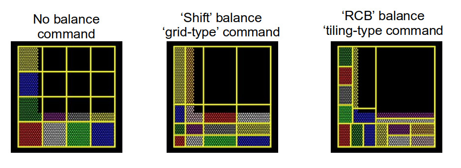
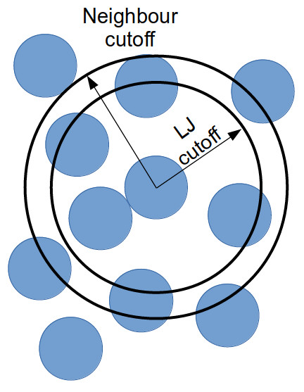

:::::::::::::::::::::::::::::::::::::: questions

- "How can we improve the performance of LAMMPS?"

::::::::::::::::::::::::::::::::::::::::::::::::

::::::::::::::::::::::::::::::::::::: objectives

- "Gain an overview of submitting and running jobs on the ARCHER2 service."
- "Gain an overview of methods to improve the performance of LAMMPS."

::::::::::::::::::::::::::::::::::::::::::::::::

# Performance inprovements

There are many configurable parameters in LAMMPS that can lead to changes in performance.
Some depend on the system being simulated, others on the hardware being used.
Here we will try to cover the most relevant, using the ethanol system from the first exercise.

## Domain decomposition

In the earlier exercise, you will (hopefully) have noticed that,
while the simulation run time decreases overall as the core count is increased,
the run time was the same when run on one processor as it was when run on two processors.
This unexpected behaviour (for a truly strong-scaling system,
you would expect the simulation to run twice as fast on two cores as it does on a single core)
can be explained by looking at our starting simulation configuration and understanding how LAMMPS handles domain decomposition.

In parallel computing, domain decomposition describes the methods used to split calculations across the cores being used by the simulation.
How domain decomposition is handled varies from problem to problem.
In the field of molecular dynamics (and, by extension, within LAMMPS),
this decomposition is done through spatial decomposition
-- the simulation box is split up into a number of blocks, with each block being assigned to their own core.

By default, LAMMPS will split the simulation box into a number of equally sized blocks and assign one core per block.
The amount of work that a given core needs to do is directly linked to the number of atoms within its part of the domain.
If a system is of uniform density (i.e., if each block contains roughly the same number of particles), then each core will do roughly the same amount of work and will take roughly the same amount of time to calculate interactions and move their part of the system forward to the next timestep.
If, however, your system is not evenly distributed, then you run the risk of having a number of cores doing all of the work while the rest sit idle.

The system we have been simulating looks like this at the start of the simulation:

{alt="Starting particle configuration"}

As this is a system of non-uniform density, the default domain decomposition will not produce the desired results.

LAMMPS offers a number of methods to distribute the tasks more evenly across the processors.
If you expect the distribution of atoms within your simulation to remain constant throughout the simulation,
you can use a `balance` command to run a one-off re-balancing of the simulation across the cores at the start of your simulation.
On the other hand, if you expect the number of atoms per region of your system to fluctuate (e.g. as is common in evaporation),
you may wish to consider recalculating the domain decomposition every few timesteps with the dynamic `fix balance` command.

For both the static, one-off `balance` and the dynamic `fix balance` commands,
LAMMPS offers two methods of load balancing -- the "grid-like" `shift` method and the "tiled" `rcb` method.
The diagram below helps to illustrate how these work.

{alt="Different LAMMPS domain decomposition methods"}

:::::::::::::::::::::::::::::::::::::: challenge

## Using better domain decomposition

In your `in.ethanol` file, uncomment the `fix balance` command and rerun your simulations.
What do you notice about the runtimes?
We are using the dynamic load balancing command -- 
would the static, one-off `balance` command be effective here?

::::::::::::::::::::::::::::::: solution

The runtimes decrease significantly when running with dynamic load balancing.
In this case, static load balancing would not work as the ethanol is still expanding to fill the simulation box.
Once the ethanol is evenly distributed within the box, you can remove the dynamic load balancing.

::::::::::::::::::::::::::::::::::::::::

::::::::::::::::::::::::::::::::::::::::::::::::

:::::::::::::::::::::::::::::::::::::: challenge

## Playing around with dynamic load balancing

In the example, the `fix balance` is set to be recalculated every 1,000 timesteps.
How does the runtime vary as you change this value?
I would recommend trying 10, 100, and 10,000.

::::::::::::::::::::::::::::::: solution

The simulation time can vary drastically depending on how often re-balancing is carried out.
When using dynamic re-balancing, there is an important trade-off
between the time gained from re-balancing and the cost involved with recalculating the load balance among cores.

::::::::::::::::::::::::::::::::::::::::

::::::::::::::::::::::::::::::::::::::::::::::::

You can find more information about how LAMMPS handles domain decomposition in 
the LAMMPS manual [balance](https://docs.lammps.org/balance.html),
and [fix balance](https://docs.lammps.org/fix_balance.html) sections.

## Considering neighbour lists

Let's take another look at the profiling information provided by LAMMPS:

```
Section |  min time  |  avg time  |  max time  |%varavg| %total
---------------------------------------------------------------
Pair    | 68.063     | 68.063     | 68.063     |   0.0 | 34.51
Bond    | 5.0557     | 5.0557     | 5.0557     |   0.0 |  2.56
Kspace  | 5.469      | 5.469      | 5.469      |   0.0 |  2.77
Neigh   | 115.22     | 115.22     | 115.22     |   0.0 | 58.43
Comm    | 1.4039     | 1.4039     | 1.4039     |   0.0 |  0.71
Output  | 0.00034833 | 0.00034833 | 0.00034833 |   0.0 |  0.00
Modify  | 1.8581     | 1.8581     | 1.8581     |   0.0 |  0.94
Other   |            | 0.139      |            |       |  0.07
```
There are 8 possible MPI tasks in this breakdown:

 - `Pair` refers to non-bonded force computations.
 - `Bond` includes all bonded interactions, (so angles, dihedrals, and impropers).
 - `Kspace` relates to long-range interactions (Ewald, PPPM or MSM).
 - `Neigh` is the construction of neighbour lists.
 - `Comm` is inter-processor communication (AKA, parallelisation overhead).
 - `Output` is the writing of files (log and dump files).
 - `Modify` is the fixes and computes invoked by fixes.
 - `Other` is everything else.

Each category shows a breakdown of the least, average, and most amount of wall
time any processor spent on each category -- large variability in this
(calculated as `%varavg`) indicates a load imbalance (which can be caused by the
atom distribution between processors not being optimal). The final column,
`%total`, is the percentage of the loop time spent in the category.

In the example above, we notice that the majority of the time is spent in the `Neigh` section
-- e.g. a lot of time is spent calculating neighbour lists.
Neighbour lists are a common method for speeding up simulations with short-ranged particle-particle interactions.
Most interactions are based on inter-particle distance and traditionally the distance between every particle and every other particle would need to be calculated every timestep (this is an $O(N^2)$ calculation!).
Neighbour lists are a way to reduce this to an $\sim O(N)$ calculation for truncated short-ranged interactions.
Instead of considering all interactions between every particle in a system, you can generate a list of all particles within the truncation cutoff plus a little bit more.
Depending on the size of that "little bit more" and the details of your system, you can work out how quickly a particle that is not in this list can move to be within the short-ranged interaction cutoff.
With this time, you can work out how frequently you need to update this list.

{alt="Neighbour list schematic"}

Doing this reduces the number of times that all inter-particle distances need to be calculated:
every few timestep, the inter-particle distances for all particle pairs are calculated to generate the neighbour list for each particle;
and in the interim, only the inter-particle distances for particles within a neighbour list need be calculated
(as this is a much smaller proportion of the full system, this greatly reduces the total number of calculations).

If we dig a bit deeper into our `in.ethanol` LAMMPS input file, we will notice the following lines:

```
variable        NEIGH_TIME  equal      1    # neigh_modify every x dt

...

neigh_modify    delay 0 every ${NEIGH_TIME} check no
```

These lines together indicate that LAMMPS is being instructed to rebuild the full neighbour list every timestep (so this is not a very good use of neighbour lists).


:::::::::::::::::::::::::::::::::::::: challenge

## Changing neighbour list update frequency

Change the `NEIGH_TIME` variable to equal 10.
How does this affect the simulation runtime?

Now change the `NEIGH_TIME` variable to equal 1000. What happens now?

::::::::::::::::::::::::::::::::::::::::::::::::

Neighbour lists only give physical solutions when the update time is less than the time it would take for a particle outwith the neighbour cutoff to get to within the short-ranged interaction cutoff.
If this happens, the results generated by the simulation become questionable at best and, in the worst case, LAMMPS will crash.

You can estimate the frequency at which you need to rebuild neighbour lists by running a quick simulation with neighbour list rebuilds every timestep:

```
neigh_modify    delay 0 every 1 check yes
```

and looking at the resultant LAMMPS neighbour list information in the log file generated by that run.

```
Total # of neighbors = 1313528
Ave neighs/atom = 200.20241
Ave special neighs/atom = 7.3333333
Neighbor list builds = 533
Dangerous builds = 0
```

The `Neighbor list builds` tells you how often neighbour lists needed to be rebuilt.
If you know how many timesteps your short simulation ran for, you can estimate the frequency at which you need to calculate neighbour lists by working out how many steps there are per rebuild on average.
Provided that your update frequency is less than or equal to that, you should see a speed up.

In this section, we only considered changing the frequency of updating neighbour lists.
Two other factors that can contribute to the time taken to calculate neighbour lists are the `pair_style` cutoff distances (where applicable) and the `neighbor` skin distance.
Decreasing either of these will reduce the number of particles within the neighbour cutoff distance, thereby decreasing the number of interactions being calculated each timestep.
However, decreasing these will mean that lists need to be rebuilt more frequently -- it's always a fine balance.

You can find more information in the LAMMPS manual about 
[neighbour lists](https://docs.lammps.org/Developer_par_neigh.html) and the 
[neigh_modify](https://docs.lammps.org/neigh_modify.html) command.

## Submitting multiple sruns in one job

Jobs on ARCHER2 are charged by the node-hour.
However, some simulation systems are not big enough to justify a full node's worth of cores (128).
In these cases, we can launch several `srun` calls in one batch job, allowing us to make better use of the computational resources.

Here is what the submission script for the `in.ethanol` benchmarking that we used in an earlier lesson looks like,
when we launch all the powers of two number of cores, between 1 and 64, in one single node:


```bash
#!/bin/sh
#SBATCH --job-name=lmp_ex5
#SBATCH --nodes=1
#SBATCH --time=0:10:0
#SBATCH --hint=nomultithread
#SBATCH --distribution=block:block

# The budget code of the project
#SBATCH --account=ta215
# Standard partition
#SBATCH --partition=standard
# Short QoS since our runtime is under 20m
#SBATCH --qos=short

# load the lammps module
module load lammps/29Aug2024

# Set the number of threads to 1
#   This prevents any threaded system libraries from automatically
#   using threading.
export OMP_NUM_THREADS=1

# setup loop
for i in $(seq 0 6)
do
  cores=$((2**$i))
  echo "Running seq ${i}: ${cores} cpu cores"
  srun --nodes=1 --ntasks=${cores} --ntasks-per-node=${cores} --cpus-per-task=1 --exact \
          --mem=12500M lmp -i in.ethanol -l log.${cores}_cpus &
done

# wait for all jobs to finish
wait
```

## Hybrid MPI+OpenMP runs

When looking at the LAMMPS profiling information, we briefly mentioned that the proportion of time spent calculating `Kspace` should fall within the 10-30% region.
`Kspace` can often come to dominate the time profile when running with a large number of MPI ranks.
This is a result of the way that LAMMPS handles the decomposition of k-space across multiple MPI ranks.

One way to overcome this problem is to run your simulation using hybrid MPI+OpenMP.
To do this, you must ensure that you have compiled LAMMPS with the `OMP` package.
On ARCHER2, you can edit the `run.slurm` file that you have been using to include the following:

```bash
#SBATCH --tasks-per-node=64
#SBATCH --cpus-per-task=2

...

export OMP_NUM_THREADS=2
export SRUN_CPUS_PER_TASK=$SLURM_CPUS_PER_TASK

srun lmp -sf omp -i in.ethanol -l ${OMP_NUM_THREADS}_log.out 
```

Setting the variable `OMP_NUM_THREADS` will let LAMMPS know how many OpenMP threads will be used in the simulation.
Setting `--tasks-per-node` and `--cpus-per-task` will ensure that Slurm assigns the correct number of MPI ranks and OpenMP threads to the executable.
Setting the LAMMPS `--sf omp` flag will result in LAMMPS using the `OMP` version of any command in your LAMMPS input script.

Running hybrid jobs efficiently can add a layer of complications,
and a number of additional considerations must be taken into account to ensure the desired results.
Some of these are:

  - The product of the values assigned to `--tasks-per-node` and `--cpus-per-task`
    should be less than or equal to the number of cores on a node (on ARCHER2, that number is 128 cores).
  - You should try to restrict the number of OpenMP threads per MPI task to fit on a single socket.
    For ARCHER2, the sockets (processors) are so large that they have been subdivided into a number of NUMA regions.
    Each ARCHER2 node 2 sockets, each socket has 4 NUMA regions, each of which has 16 cores, for a total of 8 NUMA regions per node.
    Therefore, for an efficient LAMMPS run, you would not want to use more than 16 OpenMP processes per MPI task.
  - In a similar vein to the above, you also want to make sure that your OpenMP threads are kept within a single NUMA region.
    Spanning across multiple NUMA regions will decrease the performance (significantly).

These are only some of the things to bear in mind when considering using hybrid MPI+OpenMP to speed up calculations. 

:::::::::::::::::::::::::::::::::::::: keypoints

- "LAMMPS offers a number of built in methods to improve performance."
- "It is important to spend some time understanding your system and 
   considering its performance."
- "Where possible, always run a quick benchmark of your system before setting 
   up a large run."

::::::::::::::::::::::::::::::::::::::::::::::::
