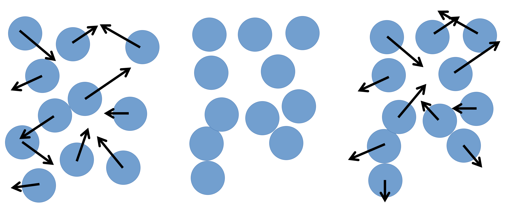
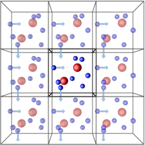

:::::::::::::::::::::::::::::::::::::: questions

- "How do we setup a simulation in LAMMPS?"
- "What do all the commands in the input file mean?"

::::::::::::::::::::::::::::::::::::::::::::::::

::::::::::::::::::::::::::::::::::::: objectives

- "Understand the commands, keywords, and parameters necessary to setup a LAMMPS simulation."

::::::::::::::::::::::::::::::::::::::::::::::::

## Intro to LAMMPS simulations

LAMMPS uses text files as input files that control the setup and flow of a simulation, and a variety of file types (and other methods) initial system for topologies.

Whether the simulation to run is MD or DEM, LAMMPS applies Newton's laws of motion to systems of particles that can range in size from atoms,
course-grained moieties, entire molecules, or even grains of sand.
In practical terms, the movement of the particles is calculated by the simple repeating loop:

  1. Take the initial positions of the particles in the simulation box and calculate the total force that is applied to each particle, using the chosen force-field.
  2. Use the calculated forces to calculate the acceleration to add to each particle.
  3. Use the acceleration to calculate the new velocity of each particle.
  4. Use the the new velocity of each particle, and the defined time-step, to calculate a new position for each particle.
  5. Repeat ad nauseum.

With the new particle positions, the cycle continues, one very small time-step at a time.

{alt="Minimalistic representation of a 2D simulation of particles"}

With this in mind, we can take a look at a very simple example of a LAMMPS input file,
`in.pour`, and discuss each command -- and their related concepts -- one by one.
The order that the commands appear in **can** be important, depending on the exact details.
Always refer to the [LAMMPS manual](lammps-manual) to check.

For this session, we'll be looking at the `2-pour-exercise/in.pour` file in your `exercises` directory.

## Simulation setup

The first thing we have to do is chose a style of units.
This can be achieved by the `units` command:

```
units         lj
```

LAMMPS has several different [unit styles](https://docs.lammps.org/units.html),
useful in different types of simulations.
In this example, we are using `lj`, or Lennard-Jones (LJ) units.
These are dimensionless units, that are defined on the LJ potential parameters.
They are computationally advantageous because they're usually close to unity,
and required less precise (lower number of bits) floating point variables --
which in turn reduced the memory requirements, and increased calculation speed.

The next line defines what style of `atoms` (LAMMPS's terminology for particle) to use:

```
atom_style    sphere
```

The [atom style](https://docs.lammps.org/atom_style.html) impacts on what
attributes each atom has associated with it -- this cannot be changed during a simulation.
Every style stores: coordinates, velocities, atom IDs, and atom types.
The `sphere` style also stores radius, mass, omega, and torque for each particle.
Other styles will store additional, or different, information.

We then define the number of dimensions in our system:

```
dimension     3
```

LAMMPS is also capable of simulating two-dimensional systems.

The boundary command sets the styles for the boundaries for the simulation box.

```
boundary      p p f
```

Each of the three letters after the keyword corresponds to a direction (x, y, z),
and `p` means that the selected boundary is to be periodic, while `f` means it's fixed,
that is, LAMMPS won't generate periodic images accross this dimension, and particles won't be able to go accross the limits of the simulation box accross this dimension.
Other boundary conditions are available (shrink-wrapped, and shrink-wrapped with minimum).

{alt="Periodic boundary conditions"}

Periodic boundary conditions (PBCs) allow the approximation of an infinite system by simulating only a small part, a unit-cell.
The most common shapes of (3D) unit-cell is cuboidal, but any shape that completely tessellates 3D space can be used.
The topology of PBCs is such that a particle leaving one side of the unit cell, it reappears on the other side.
A 2D map with PBC could be perfectly mapped to a torus.

Another key aspect of using PBCs is the use of the **minimum-image convention** for calculating interactions between particles.
This guarantees that each particle interacts only with the closest *image* of another particle,
no matter with unit-cell (the original simulation box or one of the periodic images) it belongs to.

Granular interactions depend on the velocity of neighbouring particles, so we need to setup LAMMPS to communicate the velocities of "ghost" particles between processors:

```
comm_modify     vel yes
```
The region command defines a geometric region in space.

```
region          reg block -20 20 -20 20 0 40
```

The arguments are `box`, a name we give to the region, `block`, the type of region (cuboid),
and the numbers are the min and max values for x, y, and z.

We then create a box with two "atom" types, using the region we defined previously

```
create_box      2 reg
```


### Inter-particle interactions

Now that we have a simulation box, we have to define how particles will interact with each-other once we start adding them to the box.

The first line in this section defines the style of interaction our particles will use.

```
pair_style  granular
```

LAMMPS has a large number of [pairwise interparticle interactions](https://docs.lammps.org/pair_style.html) available.
In this case, we are using the granular pair style, which supports a number of options
for normal, tangential, rolling, and twisting forces that result from the contact between particles that need to be setup, using the commands:

```
pair_coeff      1 * jkr 1000.0 50.0 0.3 10 tangential mindlin 800.0 1.0 0.5 rolling sds 500.0 200.0 0.5 twisting marshall
pair_coeff      2 2 hertz 200.0 20.0 tangential linear_history 300.0 1.0 0.1 rolling sds 200.0 100.0 0.1 twisting marshall
```


### Neighbour lists

To improve simulation performance, and because we are truncating interactions at a certain distance,
we can keep a list of particles that are close to each other (under a neighbour cutoff distance).
This reduces the number of comparisons needed per time-step, at the cost of a small amount of memory.

{% include figure.html url="" max-width="30%" file="/fig/2_MD-primer/cutoff.png" alt="Neighbour lists" %}

We can set our neighbour list cutoff to be 0.3σ greater than the default cutoff
-- remember that, as we are dealing with spheres, a small increase in radius results can result in a large volume increase.

The `bin` keyword refers to the algorithm used to build the list,
`bin` is the best performing algorithm for systems with homogeneous sizes of particles,
but there are [others](https://docs.lammps.org/neighbor.html).

```
neighbor        0.3 bin
```

These lists still need to be updated periodically.
Provided that we rebuild them more frequently than the minimum time it takes for a particle to move from within the neighbour cutoff to outside of it.
We use the `neigh_modify` command to set the wait time between each neighbour list rebuild:

```
neigh_modify    delay 10 every 1
```

The `delay` parameter sets the minimum number of time-steps that need to pass since the last neighbour list rebuild for LAMMPS to even consider rebuilding it again.
The `every` parameter tells LAMMPS to attempt to build the neighbour list if the number of timesteps since the delay ended is equal to the `every` value
-- by default, the rebuild will only be triggered if an atom has moved more than half the neighbour skin distance (the 0.3 above).

:::::::::::::::::::::::::::::::::::::::: callout

## How to set neighbour list delays?

You can estimate the frequency at which you need to rebuild neighbour lists
by running a quick simulation with neighbour list rebuilds every timestep:

```bash
neigh_modify    delay 0 every 1 check yes
```

and looking at the resultant LAMMPS neighbour list information in the log file generated by that run.

The Neighbour list builds tells you how often neighbour lists needed to be rebuilt.
If you know how many timesteps your short simulation ran for,
you can estimate the frequency at which you need to calculate neighbour lists
by working out how many steps there are per rebuild on average.
Provided that your update frequency is less than or equal to that, you should see a speed up.

::::::::::::::::::::::::::::::::::::::::::::::::

### Simulation parameters

Now that we've set up the initial conditions for the simulation, and changed some settings to make sure it runs a bit faster,
all that is left is telling LAMMPS exactly how we want the simulation to be run.
This includes, but is not limited to, what ensemble to use (and which particles to apply it to),
how big the time-step is, how many time-steps we want to simulate,
what properties we want as output, and how often we want those properties logged.

The `fix` command has a [myriad of options](https://docs.lammps.org/fix.html),
most of them related to 'setting' certain properties at a value,
or in an interval of values for one, all, or some particles in the simulation.

The first keywords are always `ID` -- a name to reference the fix by, and `group-ID` -- which particles to apply the command to.
The most common option for the second keyword is `all`.

```
fix             1 all nve/sphere
```

Then we have the styles plus the arguments.
In the case above, the style is `nve/sphere`, and there are no arguments.

Next, we enable gravity on our simulation:

```
fix             grav all gravity 9.8 vector 0 0 -1
```

### Pouring particles

To pour particles into our box, we need to setup a region where particles can appear.
We can create two cylindrical regions with the commands:

```
region          cyl1 cylinder z -10  9 10 20 35
region          cyl2 cylinder z  10 -9 10 20 35
```

Here, the parameters after `cylinder` are: the direction of the axis of the cylinder,
the coordinates of the axis in the other two dimensions,
the radius, and the low- and high- coordinate along the axis of the cylinder faces.

Then, we use the `fix pour` command to create particles in our simulation box.

```
#               ID   group-id style n_part type seed kw     region_id kw   d_style min_diam max_diam kw   min_dens max_dens
fix             ins1 all      pour  10000  1    3123 region cyl1      diam range   0.5      1        dens 1.0      1.0
fix             ins2 all      pour  10000  2    4567 region cyl2      diam range   0.5      1        dens 1.0      1.0
```

Finally, we setup the properties of our bottom wall:

```
fix             2 all wall/gran granular hertz/material 1e5 1e3 0.3 tangential mindlin NULL 1.0 0.5 zplane 0 NULL
```

### Final setup

To have a valid simulation setup, we need to set the size of the time-step, in whatever units we have chosen for this simulation -- in this case, LJ units.

```
timestep      0.001
```

The size of the time-step is a careful juggling of speed and accuracy.
A small time-step guarantees that no particle interactions are missing, at the cost of a lot of computation time.
A large time-step allows for simulations that probe effects at longer time scales, but risks a particle moving so much in each time-step,
that some interactions are missed -- in extreme cases, some particles can 'fly' right through each other.
The 'happy medium' depends on the system type, size, and other variables.

The next line sets what thermodynamic information we want LAMMPS to output to the terminal and the log file.

```
thermo_style  custom step atoms
```

There are several default styles, and the `custom` style allows for full customisation of which fields and in which order to write them.

In MD simulations (LAMMPS original use-case), losing an atom during the simulation is a catastrophic mistake, so by default LAMMPS terminates any simulation that looses particles with an error.
To change this behaviour for DEM simulations, use the `thermo_modify` command:

```
thermo_modify   lost ignore
```

To set the frequency (in time-steps) at which these results are output, you can vary the `thermo` command:

```
thermo        100
```

In this case, an output will be printed every 100 time-steps.

We can then select how to output the output trajectory files, we give here two distinct options for different visualisation programs:

```
# for Ovito:
dump            1 all custom 100 dump.pour id type radius mass x y z
# for VTK:
dump            2 all vtk 100 pour*.vtk id type radius mass x y z
dump_modify     2 binary yes
```

:::::::::::::::::::::::::::::::::::::::: caution

## NB - Using VTK

For LAMMPS to be able to output in the VTK format, the executable being used
needs to have been compiled with the VTK package support.
This requires the system being used to have the VTK library installed.
The current version of LAMMPS on ARCHER2 does _not_ have VTK support.

::::::::::::::::::::::::::::::::::::::::::::::::


And finally, we choose how many time-steps (**not time-units**) to run the simulation for:

```
run           10000
```

:::::::::::::::::::::::::::::::::::::: challenge

## Run pour simulation

What command does it take to submit the simulation to the ARCHER2 queue?
What was the output?

::::::::::::::::::::::::::::::: solution

```bash
sbatch sub.slurm
```

We will inspect the logfile in detail on the next session.

::::::::::::::::::::::::::::::::::::::::

::::::::::::::::::::::::::::::::::::::::::::::::

:::::::::::::::::::::::::::::::::::::: keypoints

- "LAMMPS can simulate systems of many particles that are allowed to interact, using any of a number of contact models."
- "A LAMMPS input file is a an ordered collection of commands with both mandatory and optional arguments."
- "To successfully run a LAMMPS simulation, an input file needs to cover basic simulation setup, read/create a system topology, force-field, and type/frequency of outputs."

::::::::::::::::::::::::::::::::::::::::::::::::
